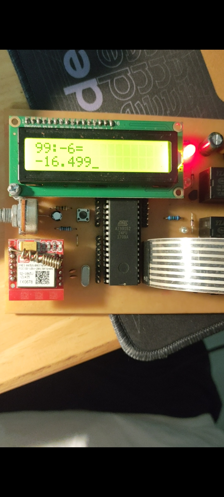

# **Calculator-8051**  
**It's Laboratory Assignment of Microcontroller Subject.**    
A basic Calculator based on **Atmel AT89S52** Microcontroller for Plus, Minus, Multiply and Divide used for **integer numbers** only. This project is realized or you can simulate in Proteus.    
**Programming Language:** C  
**System Components:** AT89S52 Microcontroller, Keypad 4x4, LCD1602.  
**Demo video**: https://drive.google.com/file/d/1NHXjDjWi0JyJYkjaT6Nd6Mb49Trvch4a/view?usp=sharing

